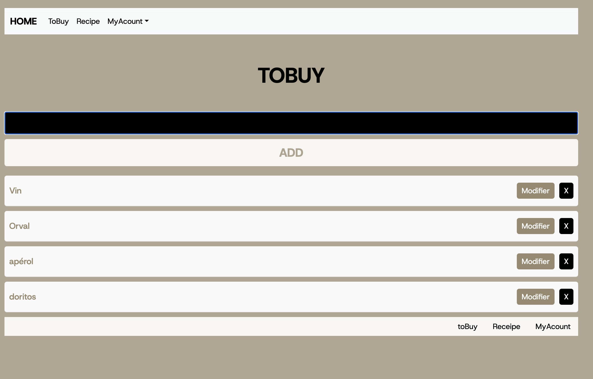

# 🛒 ToBuy List App

## 📌 description 
This is a ToBuy list app built using React and Vite.   
it features a clean and responsive design with a navigation bar.  
The app allows users to add, modify, and delete items while storing the data locally.

## 📰​ preview 

## ⚒️​ Technologies Used

⚛️ React
⚡ Vite 
🎨 CSS
🗄️ Database Storage

## 🎯 Features

📱 Responsive design 
🛍 Item management : Add, modify, and remove items from the list
💾 Local data storage : Retains the list after page refresh 

## 🔧 Future Improvements

🖥️ Implement a backend to store data permanently
🎨 Enhance UI/UX  with animations and better styling
🔗 Improve the navigation links  to make them functional

## GO TO THE LIST 
🛒 Organize your shopping list efficiently! 🛒 : [my list ](https://littlefoxy1nk.github.io/TODOLIST/#)

